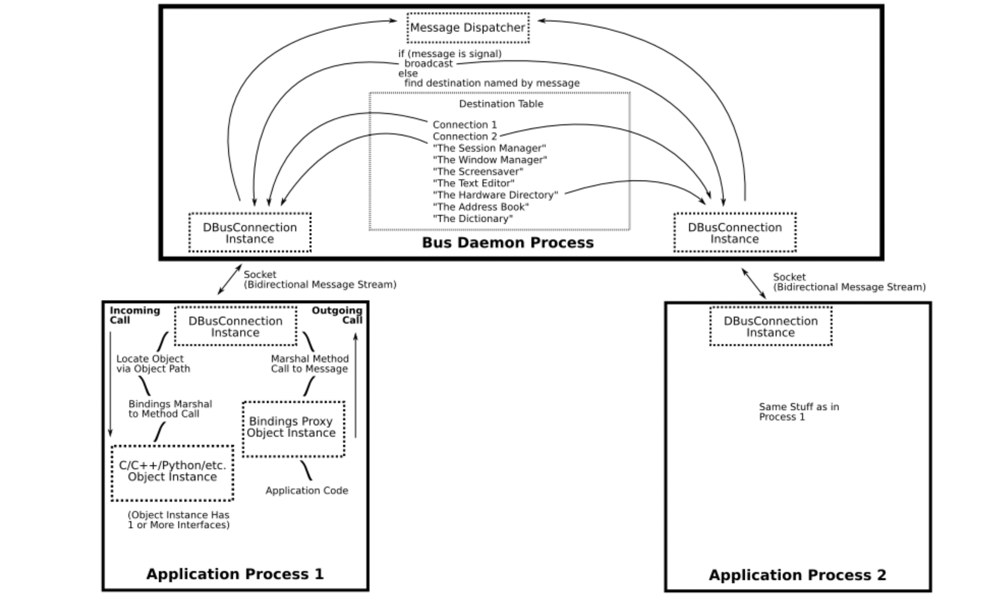

# DBus介绍
(https://www.freedesktop.org/wiki/Software/dbus/)
(https://dbus.freedesktop.org/doc/dbus-tutorial.html)
***
## 什么是DBus
DBus是一种用于桌面操作系统的IPC,D起初代表Desktop的意思，DBUS让编写一个守护进程并与其通信变得很容易。dbus通过总线让两个进程间以二进制的数据进行通信。 

### dbus 层级
* libdbus，一个用于两个进程间通信的库
* dbus daemon,构建于libdbus，多个进程可以连接到这个daemon,这个daemon负责将消息从一个进程转发到其他进程
* dbus高层API，gdbus、qdbus

### 总线分类
总线分为系统总线(system bus)和会话总线(session bus)。
- 系统总线属于操作系统，一般负责处理系统消息，处理系统和用户会话间的通信。
- 会话总线属于用户,负责处理用户应用之间的消息。
这两个总线是完全分开的

### DBus和其他IPC不同之处
- 设计为异步使用的二进制协议（类似于X窗口系统协议）。
- 可靠的连接。
- 消息总线是一个守护进程，而不是集群或分布式架构。
- 许多实现和部署问题都是指定的，而不是模糊/可配置/可插拔。
- 语义类似于现有的DCOP系统，允许KDE更容易地采用它。
- 安全的支持系统会话。

## 基本概念
### bus daemon
这是一个特殊的守护进程, 其他进程链接到这个进程，而它负责接收消息并寻址转发给目标进程。当然dbus也支持进程间点对点的直接通信而不经过bus daemon。
每条总线都有总线地址，可能是一个本地socket的地址,进程通过这个地址连接到总线，当连接建立以后．DBus服务会分配一个不可改变的连接名，称为唯一连接名．这个连接名即使在进程结束后也不会再被其他进程所使用．唯一连接名以冒号开头,(:234-888)为了方便映射这个唯一连接名，可以设置一个bus name(test.abc.hhh),daemon下是需要bus name的， 点对点的连接不需要bus name
### 对象(Object)
一个应用创建对象实例进行D-Bus的通信，方便其他进程引用。这些对象实例都有一个名字，命名方式类似于路径，例如/com/mycompany，这个名字在全局（session或者system）是唯一的，用于消息的路由。总线也是对象，对象有两种成员:接口和方法

### 方法(Method)
要执行 D-BUS 对象的方法，需要向对象发送一个方法调用消息。它将完成一些处理（就是执行了对象中的Method，Method是可以带有输入参数的。）并返回，返回消息或者错误消息。

### 信号(**Signal**)
类似广播机制，只负责发送消息，没有返回。信号可以有参数

### 接口(Interface)
每一个对象支持一个或者多个接口，将接口视为一组方法和信号,类似java,接口定义了对象实例的类型。 

DBus使用简单的命名空间字符串标识接口，如org.freedesktop.Introspectable。大多数绑定会将这些接口名称直接映射到适当的编程语言构造，例如Java接口或C++纯虚拟类

### 代理(Proxy)
代理对象用来表示另一个进程的对象, 调用代理对象的方法可以像调用本地对象的方法一样调用另一个进程对象的方法。

低级DBus API需要手动创建方法调用消息，发送它，然后手动接收和处理方法回复消息。更高级别的绑定提供了代理作为替代方案。代理看起来像一个正常的本机对象；但当在代理对象上调用方法时，绑定会将其转换为DBus方法调用消息，等待回复消息，解压缩返回值，并从本机方法返回它。

* 没有代理的伪代码
```
    Message message = new Message("/remote/object/path", "MethodName", arg1, arg2);
    Connection connection = getBusConnection();
    connection.send(message);
    Message reply = connection.waitForReply(message);
    if (reply.isError()) {
        
    } else {
        Object returnValue = reply.getReturnValue();
    }
```
* 添加代理
```
    Proxy proxy = new Proxy(getBusConnection(), "/remote/object/path");
    Object returnValue = proxy.MethodName(arg1, arg2);
```

### 总线名称(Bus Names)
当每个应用程序连接到`bus daemon`时，守护进程会立即为其分配一个名称，称为唯一连接名称。唯一名称以“:”（冒号）字符开头。这些名称在`bus daemon`的生命周期内永远不会重复使用——也就是说，知道给定的名称将始终引用相同的应用程序。唯一名称的示例可能是:34-907。冒号后面的数字除了其唯一性外没有其他意义。

当名称映射到特定应用程序的连接时，该应用程序被称为拥有该名称。

应用程序可能会要求拥有一个`well-known names`(类似ip和域名)。例如，可以编写规范来定义一个名为com.mycompany.TextEditor的名称。应用程序应在路径/com/mycompany/TextFileManager上有一个对象，支持 interface orgorg.freedesktop.FileHandler。

然后，其他应用程序可以向此总线名称、对象和接口发送消息以执行方法调用。
总线名称可以用于跟踪进程生命周期和单例进程

### 地址(Addresses)
使用D-Bus的应用程序要么是服务器，要么是客户端。服务器监听传入连接；客户端连接到服务器。一旦建立了连接，它就是对称的消息流；客户端-服务器的区别仅在设置连接时才重要。

如果使用`bus daemon`，可能是这样，应用程序将是`bus daemon`的客户端。也就是说，`bus daemon`监听连接。

D-Bus地址指定服务器将监听的位置和客户端连接的位置。例如，地址unix:path=/tmp/abcdef指定服务器将在path/tmp/abcdef处监听UNIX域套接字，客户端将连接到该套接字。地址还可以指定TCP/IP套接字，或D-Bus规范未来迭代中定义的任何其他传输。

当将D-Bus与消息`bus daemon`一起使用时，libdbus通过读取环境变量自动发现每个会话总线的地址。它通过检查著名的UNIX域套接字路径（尽管可以使用环境变量覆盖此地址）来发现系统总线的地址。

如果在没有`bus daemon`的情况下使用D-Bus，需要定义哪个应用程序将是服务器，哪个将是客户端，并指定一个机制，供他们商定服务器的地址。一般不这么使用。

地址-> \[总线名称\] -> 路径 -> 接口 -> 方法
总线名称在直接连接中是可以不使用的。

## 消息(Messages)
1. 方法调用
2. 返回调用结果
3. 调用异常的错误消息
4. 信号  

每条消息都有一个标题（包括字段）和一个正文（包括参数）。您可以将标题视为消息的路由信息，将正文视为有效负载。标题字段可能包括发件人总线名称、目标总线名称、方法或信号名称等。标题字段之一是描述正文中值的类型签名。例如，字母“i”表示“32位整数”，因此签名“ii”表示有效负载有两个32位整数。

## 调用方法(Calling a Method)
包括A进程发送到B进程的方法调用，和B进程发送到A进程的响应。这两条消息都是通过`bus daemon`传递。  
调用特点：
* 可以绑定代理：如果是这样，应用程序在代理上调用一个方法，然后代理构建一个方法调用消息以发送到远程进程
* 对于更低级的API，应用程序可以自己构建方法调用消息，不使用代理。
* 无论哪种情况，方法调用消息都包含：属于远程进程的总线名称；方法的名称；方法的参数；远程进程中的对象路径；以及指定方法的接口的名称。
* 方法调用消息发送到`bus daemon`。
* `bus daemon`查看目标进程`bus name`。如果进程拥有该名称，`bus daemon`将方法调用转发给该进程。否则，`bus daemon`创建一个错误消息，并将其作为对方法调用消息的回复发送回来。
* 接收进程解压缩方法调用消息。在简单的低级API情况下，它可能会立即运行该方法，并向`bus daemon`发送方法回复消息。使用高级绑定API时，绑定可能会检查对象路径、接口和方法名称，并将方法调用消息转换为对本机对象（GObject、java.lang.Object、QObject等）的方法调用，然后将本机方法的返回值转换为方法回复消息
* `bus daemon`接收方法回复消息，并将其发送到进行方法调用的进程。
* 调用方法的进程接收返回值，

当有多个调用时接收方会按调用顺序接收，但接收方不需要按顺序回复调用。方法调用有一个唯一的序列号，方法调用者用于将回复消息与调用消息匹配。

## 信号(Signal)
信号的发射器（又称发送器）对信号接收器一无所知。接收者在`bus daemon`中注册，以接收基于“匹配规则”的信号——这些规则通常包括发送者和信号名称。`bus daemon`仅向对该信号表示兴趣的收件人发送每个信号。

- 创建信号消息并发送到`bus daemon`。使用低级API时，这可能是手动完成的，在某些绑定中，当本机对象发出本机信号或事件时，绑定可能会自动完成信号发送。

- 信号消息包含指定信号的接口的名称；信号的名称；发送信号的过程的总线名称；以及任何参数

- 消息总线上的任何进程都可以注册“匹配规则”，指示它感兴趣的信号。总线有一个注册匹配规则列表。

- `bus daemon`检查信号并确定哪些过程对此感兴趣。它向这些进程发送信号消息。

- 每个接收信号的过程都决定如何处理它；如果使用绑定，绑定可以选择在代理对象上发出本机信号。如果使用低级API，该过程可能只是查看信号发送者和名称，并在此基础上决定该怎么做。



 


